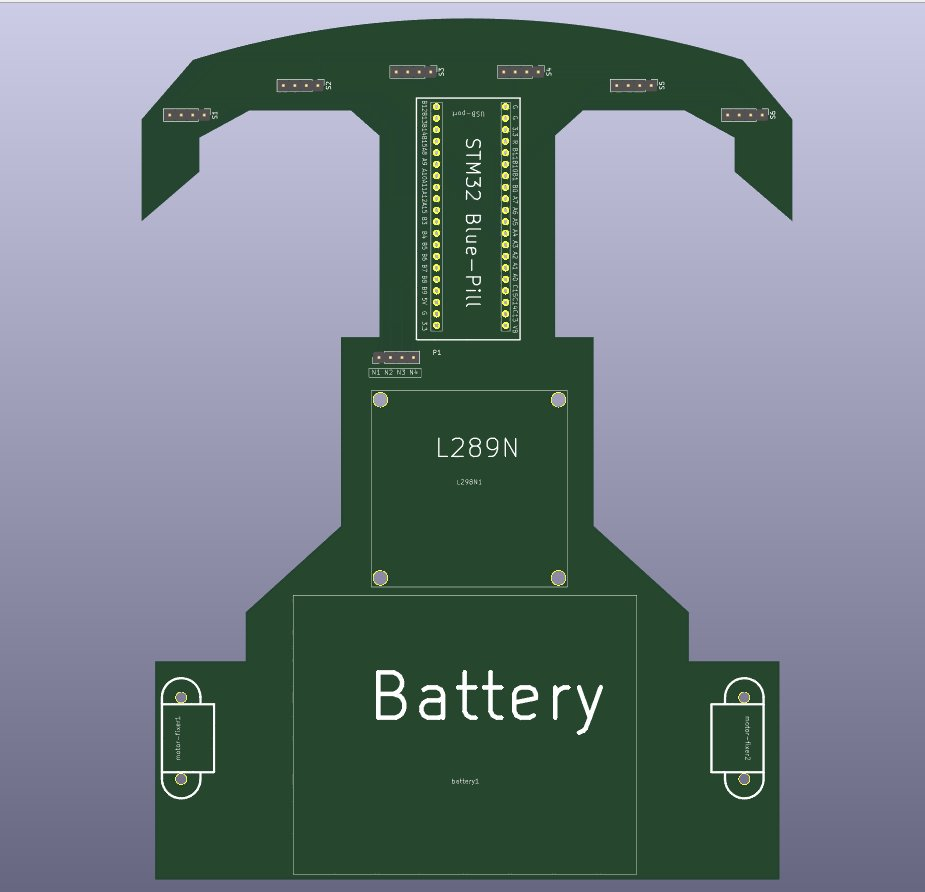
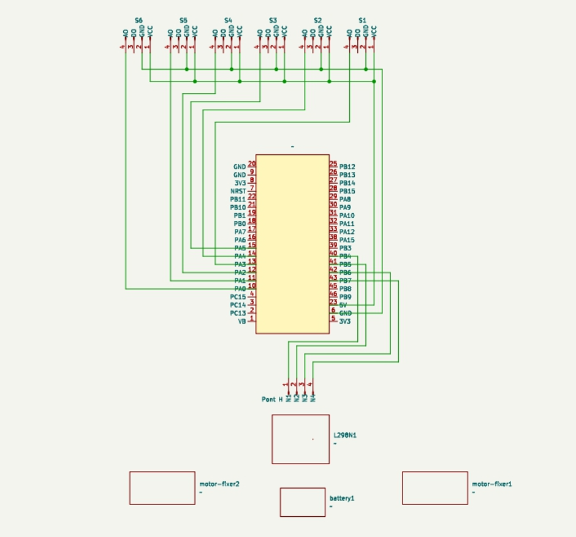

# STM32-Line-Follower-with-PID-Controller-Optimization — BACHAWANGUI

[](LICENSE)
[]()
[]()
[]()

> **BACHAWANGUI** is a fully autonomous line-following robot designed and built from scratch for the **ROBOCUP ENSI 7.0** competition. The project encompasses mechanical design (SolidWorks), custom PCB design (KiCad), embedded firmware (PID control), and 3D component modeling.

---

## 📸 PCB Design & Wiring Schematic

<p align="center">
  
  &nbsp;&nbsp;
  
</p>

<p align="center">
  <em>Left: Custom PCB layout (KiCad) — STM32 Blue Pill, L298N, Battery, N20 Motors &amp; IR Sensors integrated</em><br/>
  <em>Right: Full wiring schematic — sensor array, MCU, motor driver &amp; power connections</em>
</p>

---

## 📌 Abstract

In this project, a modified PID controller and open-loop control mechanisms were implemented to improve the stability and robustness of a differential wheeled robot. A test platform was constructed using low-cost, off-the-shelf components including a microcontroller, IR reflectance sensors, and a motor driver. This document describes the heuristic approach used for system identification and controller optimization. The PID controller is analyzed in detail, with the effect of each term explained in the context of line-following stability. Challenges encountered during hardware and software development are also discussed.

---

## 🏗️ Project Architecture

```
BACHAWANGUI/
│
├── ⚙️  Mécanique     → Chassis design (SolidWorks), MDF cutting, assembly
├── ⚡  Électrique     → Wiring, sensor integration, motor connections
├── 💻  Informatique  → PID firmware (Arduino C++), strategy selection
└── 🖥️  PCB Design    → Custom PCB (KiCad), 3D footprints from scratch
```


---

## 🧩 Components

| Component | Description | Quantity |
|-----------|-------------|----------|
| **STM32 Blue Pill** (STM32F103C8) | Main MCU — later replaced by Arduino Mega | 1 |
| **Arduino Mega** | Final competition MCU | 1 |
| **N20 DC Motors** | Micro gear motors (6V) | 2 |
| **IR Sensors** | Infrared line detection sensors | 6 |
| **L298N Motor Driver** | Dual H-bridge motor driver module | 1 |
| **Carte de Puissance** | Custom power management board | 1 |
| **Battery Pack (3× AA)** | 4.5V power supply | 1 |
| **Scroll wheel** | Front passive caster wheel | 1 |
| **MDF Chassis** | Custom-cut wooden frame | 1 |

---

## 🖥️ Software Stack

| Layer | Tool / Framework |
|-------|-----------------|
| Mechanical CAD | SolidWorks |
| PCB Design | KiCad |
| 3D Component Modeling | SolidWorks / KiCad 3D |
| Embedded Firmware | Arduino C++ / STM32 HAL (C) |
| Schematic Design | KiCad Schematic Editor |

---

## 🔌 Wiring & Schematic

The wiring connects 6 independent IR sensors to the microcontroller's digital inputs (PA0–PA5), which runs a PID control loop and outputs PWM signals to the L298N motor driver (via PB0, PB1, PB6, PB7), which in turn drives the two N20 motors.

```
[6× IR Sensors] ──(OUT)──► [STM32 / Arduino Mega]
                                     │
                              [PID Algorithm]
                                     │
                            [L298N Motor Driver]
                               /            \
                       [N20 Motor L]    [N20 Motor R]
                       
[Battery Pack] ──(+4.5V)──► [L298N 12V] ──(5V reg.)──► [IR Sensors VCC]
[Battery Pack] ──(GND)   ──► [Common Ground Rail]
```

<p align="center">
  
</p>

### Pin Mapping

| STM32 / Arduino Pin | Connected To |
|---------------------|-------------|
| PA0 | IR Sensor 1 — OUT |
| PA1 | IR Sensor 2 — OUT |
| PA2 | IR Sensor 3 — OUT |
| PA3 | IR Sensor 4 — OUT |
| PA4 | IR Sensor 5 — OUT |
| PA5 | IR Sensor 6 — OUT |
| PB0 | L298N — IN1 |
| PB1 | L298N — IN2 |
| PB6 | L298N — IN3 |
| PB7 | L298N — IN4 |
| PA6 | L298N — ENA (PWM) |
| PA7 | L298N — ENB (PWM) |
| 3.3V / 5V | IR Sensors — VCC |
| GND | Common ground |

---

## ⚙️ Mechanical Design

The chassis was designed in **SolidWorks** then cut from **MDF wood**. A rear perpendicular support bracket was attached to hold the motor assembly. Key design constraints followed the **ROBOCUP ENSI 7.0** specifications.

<p align="center">
  <!-- SolidWorks chassis design — see Main_System_Assembly in the dossier -->
</p>

---

## 🖨️ PCB Design

A **custom PCB** was designed in **KiCad** to integrate all components onto a single board, eliminating loose wiring and improving reliability. Key contributions include:

- ✅ **STM32 Blue Pill** — full schematic symbol, PCB footprint, and 3D model created from scratch
- ✅ **N20 Motors** — custom mounting footprint and 3D model
- ✅ **IR Sensors** — custom connector footprint (6× individual sensors)
- ✅ **Power board (Carte de Puissance)** — custom slot and footprint
- ✅ **Battery holders (3× AA)** — custom 3D model and footprint
- ✅ **Scroll wheel** — custom 3D model for spatial validation

> 💡 All custom KiCad library assets are located in `/hardware/lib/`

---

## 🧠 PID Controller

The robot uses a **PID (Proportional-Integral-Derivative)** controller to follow the line with minimal oscillation:

```
error       = sensor_weighted_position − setpoint
correction  = Kp×error + Ki×∫error dt + Kd×d(error)/dt

motor_left  = base_speed + correction
motor_right = base_speed − correction
```

Parameters Kp, Ki, Kd were tuned heuristically during testing sessions. The sensor array of **6 IR sensors** provides a weighted position estimate of the line relative to the robot center.

---

## 📁 Repository Structure

```
BACHAWANGUI/
│
├── firmware/
│   ├── stm32/              # Original STM32 HAL firmware (C)
│   └── arduino/            # Final competition firmware (Arduino C++)
│       └── pid_linefollower.ino
│
├── hardware/
│   ├── schematics/         # KiCad schematic files (.kicad_sch)
│   ├── pcb/                # PCB layout files (.kicad_pcb)
│   ├── lib/                # Custom footprints, symbols & 3D models
│   │   ├── stm32_bluepill/
│   │   ├── n20_motor/
│   │   ├── ir_sensor/
│   │   ├── power_board/
│   │   └── battery_holder/
│   └── gerbers/            # Manufacturing-ready Gerber files
│
├── mechanical/
│   └── solidworks/         # SolidWorks chassis & component files (.SLDPRT)
│
├── docs/
│   ├── robot_photo.jpg        # Robot photo (ROBOCUP competition)
│   ├── DOSSIER-TECHNIQUE.pdf  # Full technical dossier
│   └── Main_System_Assembly/  # SolidWorks 3D assembly files
│
├── PCB_part/                  # KiCad PCB project files
│   ├── *.kicad_pcb
│   ├── *.kicad_sch
│   └── lib/                   # Custom footprints & 3D models
│
├── pcb_design.png             # PCB 3D render (KiCad)
└── schematic.svg              # Wiring schematic diagram
│
└── README.md
```

---

## 🚀 Getting Started

### Requirements

- [Arduino IDE](https://www.arduino.cc/en/software) — for Arduino Mega firmware
- [STM32CubeIDE](https://www.st.com/en/development-tools/stm32cubeide.html) — for STM32 firmware
- [KiCad 7+](https://www.kicad.org/) — for PCB files
- [SolidWorks 2022+](https://www.solidworks.com/) — for mechanical files

### Build & Upload (Arduino)

```bash
# 1. Open firmware/arduino/pid_linefollower.ino in Arduino IDE
# 2. Select: Tools → Board → Arduino Mega 2560
# 3. Select the correct COM port
# 4. Click Upload
```

---

## 🏁 Competition

The **BACHAWANGUI** robot was entered into the **ROBOCUP ENSI 7.0** competition, organized under the **AEROBOTIX** club (robotics & aeronautics pole of INSAT). The robot competed on both straight and curved track segments.

> Mid-development, the STM32 Blue Pill was replaced with an **Arduino Mega** to resolve firmware timing issues under competition deadline pressure. The team adapted rapidly and competed successfully — a real lesson in engineering resilience and adaptability.

---

## 👥 Team & Club

**Club:** [AEROBOTIX](https://www.instagram.com/aerobotix.insat/) — Pôle Robotique & Aéronautique de l'INSAT  
> AEROBOTIX is Tunisia's leading robotics and aeronautics club with 150+ members, 100+ national competition entries, 17 international participations, and 35+ medals.

| Role | Contribution |
|------|-------------|
| PCB Design & Hardware | Custom PCB, KiCad footprints, 3D models |
| Mechanical Design | SolidWorks chassis, MDF fabrication |
| Firmware | PID algorithm, Arduino/STM32 |
| Electronics | Wiring, sensor integration, power management |

---

## 📄 License

This project is licensed under the [MIT License](LICENSE).

---

> *"The best engineering happens when creativity meets constraints."*
